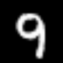
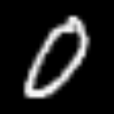
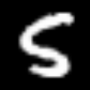
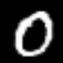
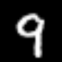
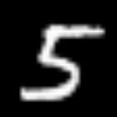

# Latent Interpolation on MNIST
I found doing linear interpolation in the latent space quite gratifying to watch. So I have created this respository which allows you to create a countdown or countup GIF with MNIST images using smooth transitions that comes from the latent space. 

## Sample Output
You can choose any range of numbers from 0-9 to create the GIF.
<table style="width:100%; border:0;">
  <thead>
    <tr>
      <th>Countdown 9-0</th><th>Count Up 0-9</th>
      <th>Countdown 5-0</th><th>Count Up 0-5</th>
      <th>Countdown 9-5</th><th>Count Up 5-9</th>
    </tr>
  </thead>
  <tr>
    <td align="center"></td>
    <td align="center"></td>
    <td align="center"></td>
    <td align="center"></td>
    <td align="center"></td>
    <td align="center"></td>
  </tr>
</table>

## Quick Usage
You need to first download this [pre-trained model]("https://drive.google.com/file/d/1duzTd7HGFt-2AKlXOU9sOFZpJ6dcV1Fb/view?usp=sharing") to begin generating your own GIFs.

Then simply run the following:
```
python main.py --model-path <path-to-saved-model>
```
You can find below a detailed list of the available command line arguments that you can use to customize your GIF.

## CLI Arguments
### Training Arguments
|       Long      | Short |             Description            | Default |
|:---------------:|:-----:| ---------------------------------- |---------|
| --train         | -t    | flag to train model from scratch   | False   |
| --epochs        | -e    | number of epochs used for training | 250     |
| --batch-size    | -b    | batch size used in training        | 400     |
| --save-interval | -s    | save model every interval          | 50      |

### Generator Arguments
|     Long     | Short |                  Description                 | Default             |
|:------------:|:-----:| -------------------------------------------- |---------------------|
| --generate   | -g    | flag to generate gif from an existing model  | True                |
| --imsize     | -i    | image size of generated gif                  | 128                 |
| --start-num  | -a    | count down/up starts with this number        | 9                   |
| --end-num    | -z    | count down/up ends with this number          | 0                   |
| --n-steps    | -n    | number of steps used in latent interpolation | 30                  |
| --out-path   | -o    | output folder path to save generated gif     | ./output            |
| --out-name   | -l    | name of generated gif                        | countdown.gif       |
| --model-path | -m    | path to pre-trained Keras model              | models/model-250.h5 |
